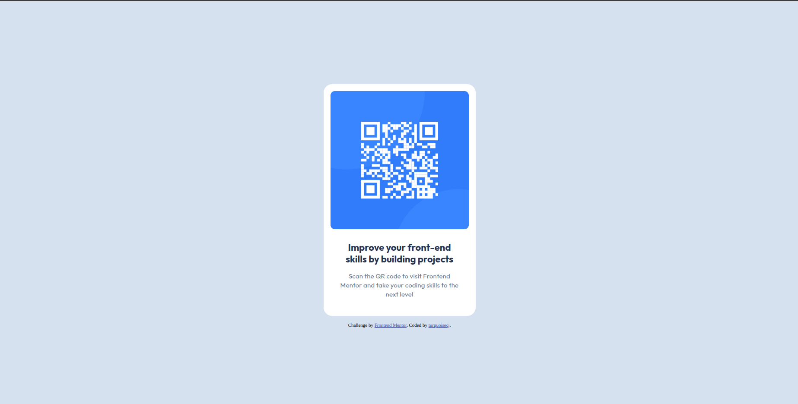
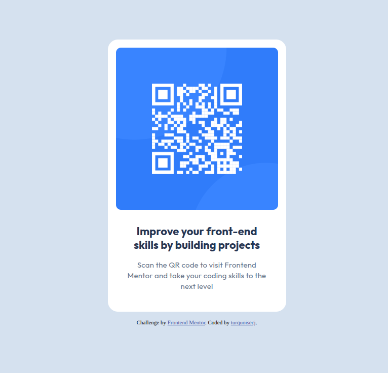

# Frontend Mentor - QR code component solution

This is a solution to the [QR code component challenge on Frontend Mentor](https://www.frontendmentor.io/challenges/qr-code-component-iux_sIO_H). Frontend Mentor challenges help you improve your coding skills by building realistic projects.

## Table of contents

- [Overview](#overview)
  - [Screenshot](#screenshot)
  - [Links](#links)
- [My process](#my-process)
  - [Built with](#built-with)
  - [What I learned](#what-i-learned)
  - [Continued development](#continued-development)
  - [Useful resources](#useful-resources)
  - [AI Collaboration](#ai-collaboration)
- [Author](#author)
- [Acknowledgments](#acknowledgments)

## Overview

### Screenshot

;

- Solution URL: [Add solution URL here](https://your-solution-url.com)
- Live Site URL: [Add live site URL here](https://your-live-site-url.com)

## My process

### Built with

- Semantic HTML5 markup
- CSS custom properties
- Flexbox
- CSS Grid
- Mobile-first workflow

### What I learned

- Proper use cases of `<header>` element
- `<figure>` and `<figcaption>` element usage
  - I learned that figure and figcaption alone is needed for semantically establishing a relationship between a figure and a caption as a self contained content.

### Continued development

- Implementation of accessibility features to future projects if needed.
- Understand and learn more about accessibility.

### Useful resources

- [<header>](https://developer.mozilla.org/en-US/docs/Web/HTML/Reference/Elements/header) - This helped me for understanding when to use header element.
- [`<figure>` and `<figcaption>`](https://www.elegantthemes.com/blog/divi-resources/when-to-use-figure-and-figcaption-html-elements-in-divi-5) - This resource explains the semantic nature of figure and figcaption.
-

## Author

- Website - [@turquoisecj](https://github.com/turquoisecj)
- Frontend Mentor - [@turquoisecj](https://www.frontendmentor.io/profile/turquoisecj)
